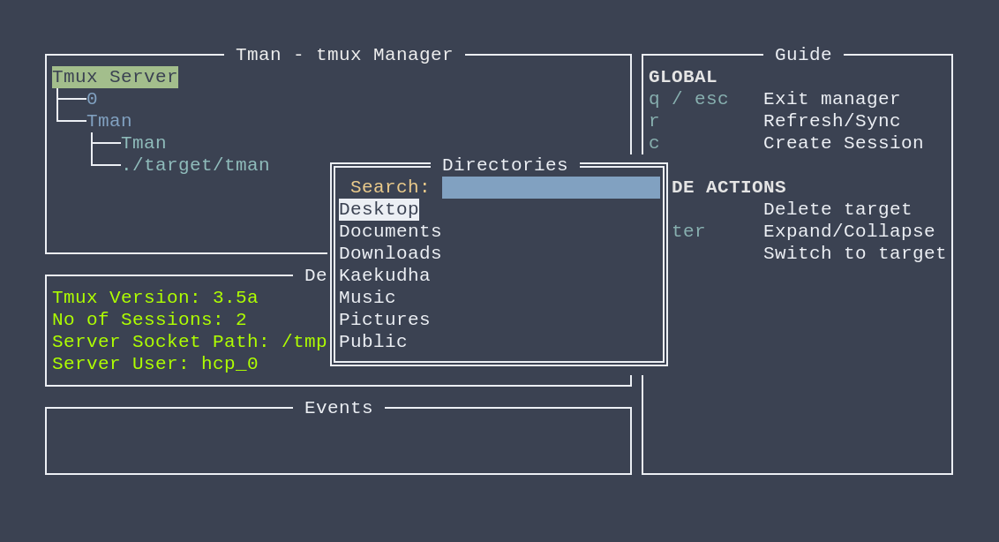

# Tman

**Lightweight Manager for Tmux.**

A terminal UI for browsing, pruning and growing your tmux server. Tman renders the
whole `Server → Session → Window → Pane` hierarchy as a navigable tree compared to 
tmux's own prefix-key interface.


## What it is

Tman shells out to your local `tmux` binary and mirrors the server as a tree:

```
Tmux Server
├── session: main
│   ├── 1: bash
│   │   ├── 0. bash  ~/projects/Tman
│   │   └── 1. vim   ~/projects/Tman
│   └── 2: server
└── session: logs
    └── 1: tail
```

Nodes are colour-coded by depth — server (green), session (blue), window (aqua),
pane (purple) — and the layout is three panels, plus an overlay that appears when you
create a session:

| Panel | Behaviour |
| --- | --- |
| **Tree** | The server hierarchy. Children load the first time you expand a node. |
| **Details** | Everything known about the node under your cursor — created-at, socket path, pane command, and so on. |
| **Events** | The outcome of your last action. |
| **Guide** | The keybindings, so you never have to remember them. |
| **Directories** *(overlay)* | Searchable list of folders to start a new session in. Opens over the tree on `c`. |

## Features

- Browse the server, session, window and pane hierarchy from a single tree.
- Lazy expansion — one `tmux` call per level, only when you ask for it.
- Delete any component: the server, a session, a window or a pane.
- Create a session from any folder under a working directory, with a searchable picker.
- Switch the attached tmux client straight to a session, window or pane with `s`.
- Re-sync the whole tree from a live tmux server at any time.
- Per-node details, action feedback and an in-app keybinding guide.
- No config file, no daemon, no background state.

## Requirements

- **A running tmux server with at least one session.** Tman observes an existing
  server; it does not start one.
- **`tmux` on your `PATH`.** All queries go through the tmux CLI, not a socket
  library.
- **To switch targets with `s`, run Tman from inside tmux.** Switching acts on the
  attached *client*, so outside a tmux session tmux answers `no current client` and
  nothing happens.
- **Go 1.26.3 or newer** to build from source (pinned in `go.mod`).

## Build and run

```bash
git clone https://github.com/Harichandra-Prasath/Tman.git
cd Tman
make build-binary
```

That produces `target/tman`. Start a session if you do not already have one, then
launch the manager:

```bash
tmux new -s main      # only if no server is running yet
./target/tman
```

`make build-binary` honours overrides, so you can place the binary directly:

```bash
make build-binary TARGET_DIR=~/.local/bin
```

The raw invocation, if you would rather skip the Makefile:

```bash
go build -C cmd/tman -o target/tman
```

Tman takes one flag, `-work-dir`, the folder whose subfolders are offered when you
create a session. It defaults to `$HOME` and must exist:

```bash
./target/tman -work-dir ~/code
```

## Keybindings

| Key | Scope | Action |
| --- | --- | --- |
| `q` / `Esc` | Global | Quit Tman |
| `r` | Global | Refresh — re-sync the tree from the tmux server |
| `c` | Global | Create a session — opens the folder picker |
| `Enter` | Node | Expand / collapse (fetches children on first expand) |
| `d` | Node | Delete the selected component |
| `s` | Node | Switch the attached tmux client to the selected component, then quit Tman |

Deleting the last child of a node removes that parent from the tree as well, so the
view keeps matching the server.

> **Careful:** `d` on the server node runs `tmux kill-server` — it takes down every
> session, window and pane at once. There is no confirmation prompt.

### Creating a session

Press `c` anywhere and Tman overlays a **Directories** panel listing every folder
inside your working directory:



- Type to filter — the match is a case-insensitive substring, updated as you type.
- `↓` moves from the search field into the list, `↑` jumps back, `Esc` closes the
  overlay without doing anything.
- `Enter` on a folder runs `tmux new-session -d -c <work-dir>/<folder>`, naming both
  the session and its window after the folder.

A few things worth knowing about what you get:

- The session is created **detached**. You stay in Tman, the new node appears under
  the server in blue, and the Events panel reports `New Session Created: <name>`.
  Press `s` on it when you are ready to drop in.
- Hidden folders are offered too, but they lose their leading dot for the name —
  `.config` becomes the session `config`, and it still starts inside `.config`.
- Folders only. Files in the working directory are never listed.
- If the name is already taken by an existing session, tmux refuses and the error
  lands in the Details panel; nothing is added to the tree.

### Switching targets

`s` on a session, window or pane runs `tmux switch-client -t <target>`, then Tman
exits and hands your terminal back to tmux — which is now displaying the target. In
effect Tman is a launcher: you drop into the session you picked and run Tman again
when you want to come back. Because it switches the *current* client, this only works
when Tman itself is running inside a tmux session.

There is nothing to switch to on the server node, so `s` is a no-op there.

One detail worth knowing: the "Switched to …" confirmation is written to the Events
panel and then the application stops, so you will not actually see it. The handoff is
the feedback.

## How it works

Tman is two small layers with a clean seam between them.

**`pkg/tman` — the domain.** Every entity implements a single interface:

```go
type TmuxComponent interface {
    Name() string          // the tree label
    Details() string       // the Details panel
    GetParent() TmuxComponent
    GetChildCount() int
    SetChildCount(int)
}
```

with four implementations — `Root` (the server), `Session`, `Window` and `Pane` —
each holding a reference back up to its parent.

- `engine.go` issues the queries: `tmux list-sessions`, `tmux list-windows` and
  `tmux list-panes`, each with a `-F` format string that shapes the output into
  colon-delimited fields for the parsers.
- `events.go` maps actions onto tmux with a type switch. Deletion: `Root` →
  `kill-server`, `Session` → `kill-session`, `Window` → `kill-window`, `Pane` →
  `kill-pane`. Switching: the same three levels → `switch-client`. Targets
  are assembled from the parent chain, so a pane is addressed as
  `session:window.pane`.
- `CreateSessionComponent` builds `tmux new-session -d -c <dir> -n <name> -s <name>`
  from the selected folder, then constructs the `Session` itself rather than
  re-querying tmux for it.
- `core.go` carries `TmanConfig`, the one struct the CLI and the UI share. `cmd/tman`
  parses `-work-dir` into it before the UI ever starts.

**`pkg/ui` — the presentation.** A tview `TreeView` beside three `TextView` panels,
with key handling split into a global capture and a per-node capture. The whole thing
lives on a `tview.Pages`, so the folder picker can sit on a page above it.

- Nodes are wrapped in a `TmuxTreeNode`, which pairs a component with its
  `*tview.TreeNode` parent. That parent link is what lets the UI prune the tree
  independently of the domain objects.
- `populate.go` fetches children on selection: expanding a session runs
  `list-windows`, expanding a window runs `list-panes`. A node that already has
  children toggles instead.
- `events.go` implements deletion, recursing upward to drop parents that have just
  lost their last child, and handles `s` by issuing the switch and stopping the
  application so the terminal goes back to tmux. Its global capture also owns `c`.
- `dropdown.go` builds the folder picker: an `InputField` that re-filters a `List` on
  every keystroke, with focus hopping between the two. Choosing a row calls into
  `pkg/tman` and appends the new session to the tree in place — no refresh needed.

One `tmux` subprocess per expansion and per mutation, and nothing is cached between
them.

## Roadmap

Tman is young, and every rough edge below is something intended to fix. Next major features that are planned to release are  
 
- [x] ~~Switch to diffrent sessions using a key (similar to `tmux switchc -t $TARGET_SESSION`)~~ — **done.** `s` on a session, window or pane, via `tmux switch-client -t <target>`
- [x] ~~Create Sessions, Windows, Panes under a valid Parent or Root~~ — **sessions done.** `c` opens a folder picker and runs `tmux new-session`
- [ ] Creation for windows and panes (the above only covered sessions)
- [ ] Start with no sessions existing — you still need a running server to open Tman, so the create feature cannot seed the first one
- [ ] General Improvements on Performance (Reducing subprocesses)


## Contributing

Fork, branch, keep the loop green, open a pull request. There is no CI, so this is
your only gate:

```bash
gofmt -l .          # expect no output
go vet ./...
go test ./...       # no tests exist yet
make build-binary
```

## License

MIT © 2026 Harichandra Prasath. See [LICENSE](LICENSE).
